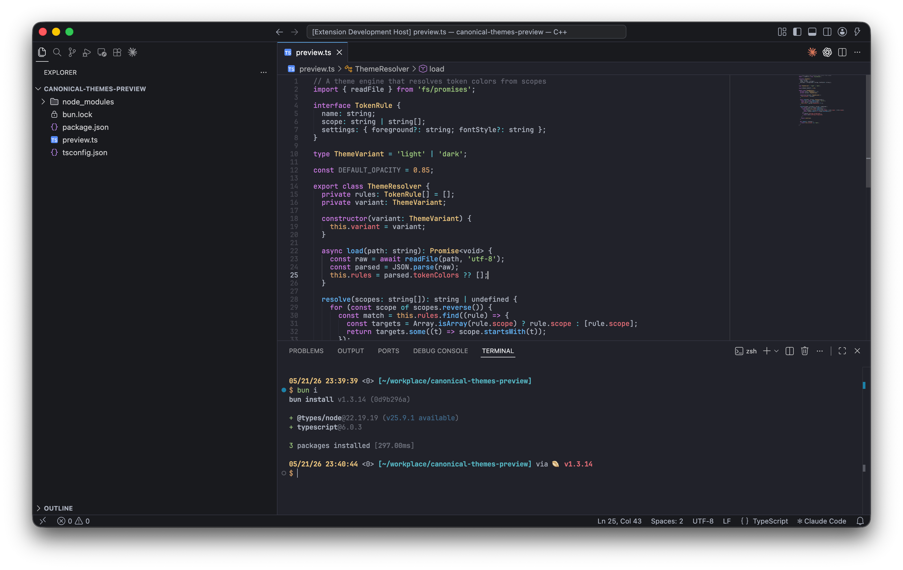
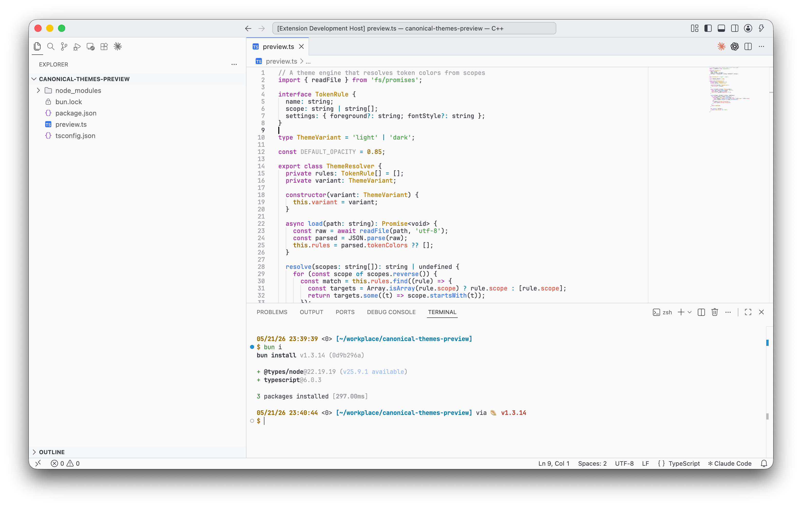

# Canonical Themes

<p>
  
</p>

<p>
  
  
</p>

Popular color themes for VS Code on neutral UI chrome.

- 100% faithfully rebuilt from original palettes
- Full 16-color ANSI terminal mapping per theme
- Border contrast calibrated to 1.2 (GitHub Primer's standard)
- WCAG 2.1 AA variants with contrast calibrated to 4.5:1
- No italic tokens

## Themes

| Theme | Base |
| ----- | ---- |
| Atom One Light | Light with neutral chrome |
| Atom One Light (Dark Header) | Light editor, dark title/activity bar |
| Atom One Dark | Dark with subtle cool-blue tint |
| Dracula Plus | Dracula syntax on neutral black |
| Catppuccin Latte | Catppuccin pastels on neutral white |
| Catppuccin Latte (Dark Header) | Light editor, dark title/activity bar |
| Catppuccin Mocha | Catppuccin pastels on neutral black |
| Alabaster Dark | Minimal highlighting (comments, strings, constants, definitions) |
| Alabaster Dark+ | Alabaster palette with full syntax coverage |
| Tango Dark | Tango terminal palette adapted for code |
| Xcode Default Light | Xcode default palette on neutral white |

Each theme above has a **(WCAG 2.1 AA)** variant with adjusted colors, except Alabaster Dark (plain).

## Install

Search "Canonical Themes" in the VS Code extensions marketplace, or install from VSIX:

```sh
code --install-extension canonical-themes-0.1.1.vsix
```

## Credits

Color palettes adapted from:

- [Atom One](https://github.com/atom/atom) by GitHub
- [Dracula](https://github.com/dracula/dracula-theme) by Zeno Rocha
- [Catppuccin](https://github.com/catppuccin/catppuccin) by Catppuccin Org
- [Alabaster](https://github.com/tonsky/sublime-scheme-alabaster) by Nikita Prokopov
- [Tango](http://tango.freedesktop.org/) by the Tango Desktop Project
- [Xcode](https://developer.apple.com/xcode/) by Apple

These themes are independent interpretations and are not official ports or affiliated with the original projects.

## Development

```bash
bun install
bun run build        # Generate theme JSON files
bun run build:watch  # Rebuild on change
bun run lint         # Check contrast ratios
```
